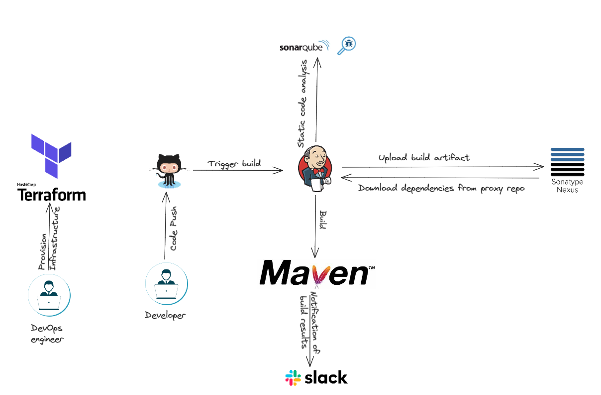

# Continuous integration using Jenkins, Nexus, SonarQube, Slack and terraform for infra provisioning:

In the ever-evolving landscape of software development, ensuring the seamless integration of code, rigorous analysis of its quality, and efficient management of artifacts is paramount. DevOps, as a philosophy, advocates for the unification of development and operations, aiming to streamline processes, enhance collaboration, and deliver high-quality software at speed.

In pursuit of these goals, this project embarks on a journey into the realm of Continuous Integration (CI), a practice that integrates code changes into a shared repository multiple times a day. Leveraging a suite of cutting-edge tools and technologies, we have orchestrated a robust CI pipeline, meticulously designed to automate and optimize the software development lifecycle.

At the heart of our CI pipeline lies Jenkins, a versatile automation server renowned for its extensibility and flexibility. With Jenkins orchestrating the flow of code, we delve deeper into ensuring code quality through static code analysis, courtesy of SonarQube. This powerful tool scrutinizes our codebase, identifying potential bugs, vulnerabilities, and code smells, empowering us to rectify issues proactively and maintain code integrity.

However, CI is not solely about code analysis; it encompasses efficient artifact management to facilitate seamless deployment. Here, Nexus steps in as our artifact repository manager, providing a centralized hub for storing and managing our precious artifacts, such as WAR files. With Nexus, we not only ensure artifact availability but also enforce version control and dependency management, fostering a stable and reliable software delivery process.

Moreover, the significance of communication and collaboration cannot be overstated in a CI environment. Hence, we have integrated Slack into our pipeline, enabling real-time notifications and fostering transparent communication among team members. Whether it's build statuses, code analysis reports, or deployment alerts, Slack keeps the team informed, aligned, and responsive.

Beyond the software realm, infrastructure provisioning plays a pivotal role in ensuring the reliability and scalability of our CI environment. Leveraging Terraform, an infrastructure as code (IaC) tool, we have codified our infrastructure requirements, automating the provisioning of Jenkins, SonarQube, and Nexus servers, along with the necessary networking components within a Virtual Private Cloud (VPC). This approach not only accelerates environment setup but also promotes consistency and repeatability across environments.

In essence, our CI project encapsulates the synergy between automation, quality assurance, artifact management, and infrastructure provisioning, epitomizing the essence of DevOps principles. Through meticulous planning, diligent implementation, and continuous refinement, we aspire to foster a culture of agility, collaboration, and innovation, driving towards excellence in software delivery.

## Architecture Diagram:

## What tools I used in this project:

- Jenkins: AS a CI Server.
- SonarQube: Static Code Analysis.
- Maven: Build Tool.
- Nexus: Artifact repo manger.
- Terraform: Infrastructure provisioning.
- Slack: For Notifications of Build and analysis statuses.
